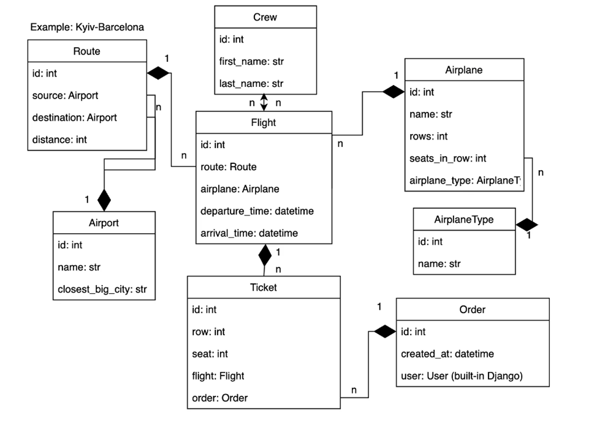

# Airport Service API

-----------------------------------

The Airport Service API is a Django-based web application that provides functionality related to airline flights, airports, airplanes, crews, and ticket booking. It serves as a backend for managing flight-related data and ticket reservations.

----

## Project Structure



Install PostgreSQL and create a database

1. Clone the repository:
git clone https://github.com/MaksNochvai/dockerize_drf_cinema.git

2. Set up a virtual environment and activate it:
```
python -m venv venv
source venv/bin/activate # Activation of the virtual environment (Unix)
venv\Scripts\activate # Activation of the virtual environment (Windows)
```
3. Install the required dependencies:
```
pip install -r requirements.txt
```
4. Set the following environment variables:
```
set POSTGRES_HOST=<your POSTGRES HOST name>
set POSTGRES_DB=<your POSTGRES DB name>
set POSTGRES_USER=<your POSTGRES USER name>
set POSTGRES_PASSWORD=<your POSTGRES PASSWORD>
set SECRET_KEY=<your SECRET_KEY>
```
5. Start the development server:
```
python manage.py migrate
python manage.py runserver
```
# Run with docker

-----------------------------------
docker should be installed
```
docker-compose build
docker-compose up
```
# Getting access

------------------------------------
- create user via /api/user/register/
- get access token via /api/user/token

## Features
- Airports: The API allows you to view and manage information about airports, including their names and closest big cities.

- Airplane Types: You can view and manage airplane types, including their names.

- Crew Members: The API provides endpoints to manage crew members, including their first names and last names.

- Airplanes: You can view and manage information about airplanes, such as names, number of rows, seats in each row, and airplane types.

- Routes: The API allows you to create and manage routes between airports, including source and destination airports and the distance between them.

- Flights: You can manage flight information, including the route, airplane, departure time, arrival time, crew members, and an optional image.

- Ticket Booking: The API enables ticket reservations for specific flights. It ensures that ticket rows and seats are within the available range for the airplane.

- Orders: Users can place orders for one or more tickets, and the API handles the order creation and ticket assignment.

------
## Technologies Used
The Airport Service API is built with the following technologies:

- Django: A powerful web framework for building web applications in Python.
- Django REST framework: A toolkit for building Web APIs with Django.
- SQLite: A lightweight, serverless database used for development purposes.
- Python: The programming language used for the backend development.
